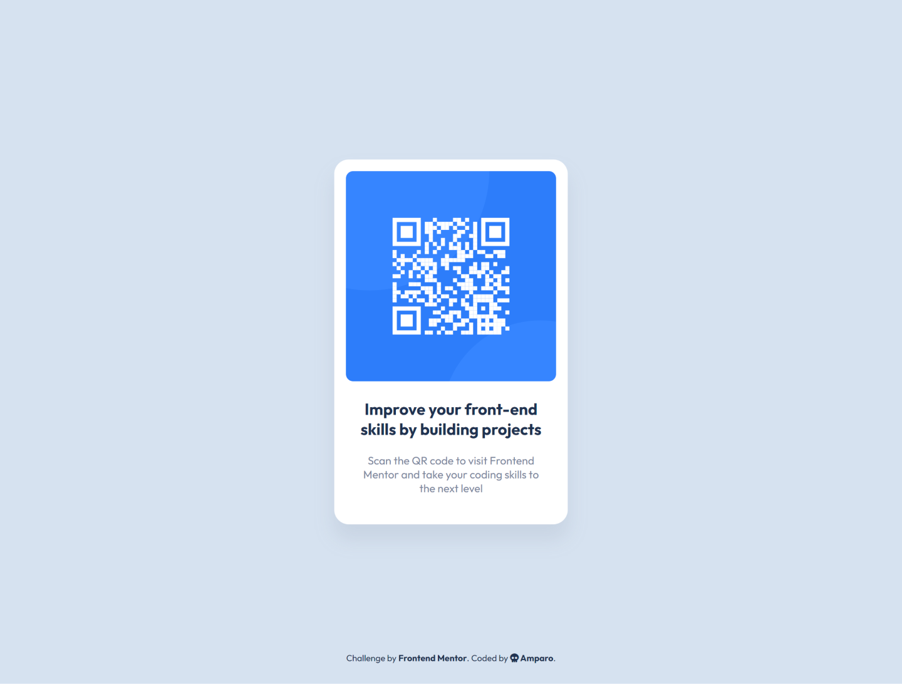

# Frontend Mentor - QR code component solution

This is a solution to the [QR code component challenge on Frontend Mentor](https://www.frontendmentor.io/challenges/qr-code-component-iux_sIO_H).

## Table of contents

- [Overview](#overview)
  - [Screenshot](#screenshot)
  - [Links](#links)
- [My process](#my-process)
  - [Built with](#built-with)
- [Author](#author)

## Overview

### Screenshots

#### Desktop

#### Mobile

### Links

- Solution URL: [Add solution URL here](https://your-solution-url.com)
- [See it live](https://amparoamparo.github.io/frontendmentor-qr-code-component/)

## My process

### Built with

- Figma (used to measure things like padding, border radii, margins, etc - Note: I do not have a Pro account, I just measured from the provided design screenshots.)
- Semantic HTML5 markup
- CSS custom properties
- Flexbox
- CSS Grid

## Author

- Amparo 💀 - [Say hello 😀](mailto:hello@amparo.ooo?subject=Hello+from+GitHub)
- Frontend Mentor - [@amparoamparo](https://www.frontendmentor.io/profile/amparoamparo)
- freeCodeCamp - [@amparo](https://freecodecamp.org/amparo)
- GitHub - [@amparoamparo](https://www.github.com/amparoamparo)
